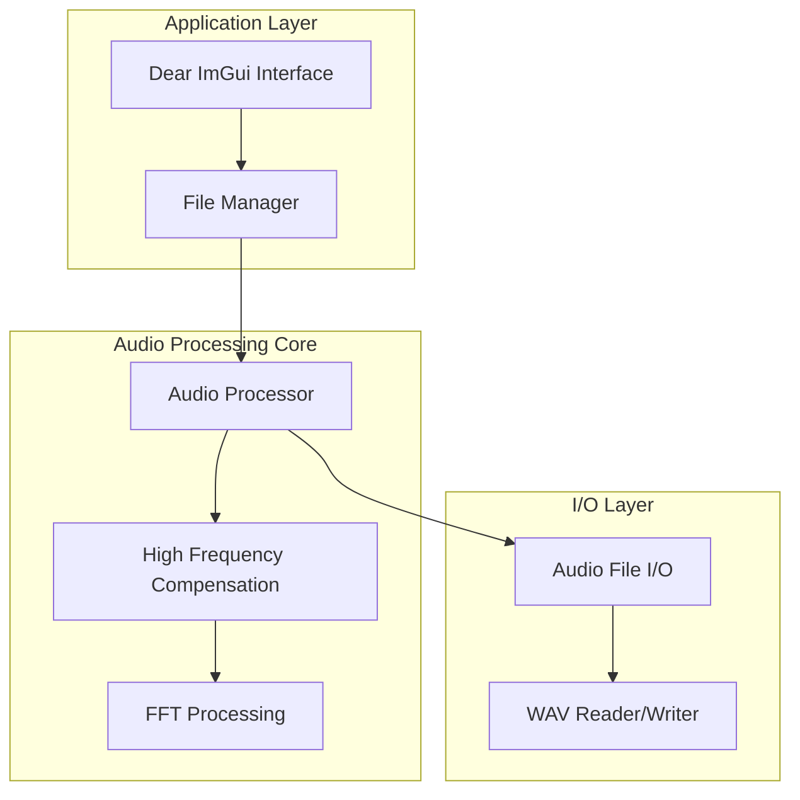

# HRAudioWizard C++ Port - Development Plan

> [!WARNING]
> This plan was also vibe-generated using my VSCode agent extension, it probably doesn't matter but I left it here for posterity.

## Project Overview
Port of the Python HRAudioWizard tool to C++ for high-performance audio processing, focusing initially on High-Frequency Compensation (HFC) to enhance low-quality audio files by reconstructing missing high frequencies.

## Goals
- High-performance C++ implementation
- Minimal dependencies
- Simple but functional Dear ImGui interface
- Focus on file processing (no real-time requirements)
- MIT licensed (same as original)

## Architecture Design



## Technology Stack
- **Language**: C++17
- **GUI**: Dear ImGui + GLFW + OpenGL
- **Audio I/O**: libsndfile (minimal dependency for reading/writing audio files)
- **FFT**: KissFFT (header-only, simple to integrate)
- **Build System**: CMake
- **Platform**: macOS (with potential for cross-platform)

## Phase 1: HFC Implementation

### Core Components

1. **Audio Processing Engine**
   - Port the `hfp()` function for high-frequency compensation
   - Implement efficient STFT/iSTFT operations
   - Griffin-Lim algorithm for phase reconstruction
   - Harmonic overtone synthesis

2. **GUI Design (Simple & Functional)**
   - File selection (drag & drop + browse button)
   - Processing options:
     - Enable/Disable HFC
     - Lowpass filter frequency slider (6000-50000 Hz, default 16000)
     - Compressed mode checkbox
   - Progress bar
   - Process button
   - Status/log area

3. **File Processing Pipeline**
   ```
   Load WAV → Convert to Float → Split to Mid/Side → STFT → 
   HFC Processing → iSTFT → Mid/Side to Stereo → Save WAV
   ```

### Implementation Steps

#### Step 1: Project Setup
- Initialize git repository
- Set up CMake project
- Configure dependencies
- Create basic window with Dear ImGui

#### Step 2: Audio I/O
- Implement WAV file reading/writing with libsndfile
- Create audio buffer management
- Test with simple pass-through

#### Step 3: DSP Core
- Port STFT/iSTFT functionality
- Implement Griffin-Lim phase reconstruction
- Port the overtone synthesis algorithm
- Port the spectral smoothing functions

#### Step 4: HFC Algorithm
- Port harmonic peak detection
- Port overtone reconstruction
- Port temporal and spectral smoothing
- Implement spectrum connection algorithm

#### Step 5: GUI Implementation
- File browser and drag-drop
- Parameter controls
- Progress reporting
- Basic error handling

#### Step 6: Optimization
- Profile and optimize hot paths
- Add multithreading where beneficial
- Memory optimization

## Project Structure
```
HRAudioWizard_CPP/
├── CMakeLists.txt
├── README.md
├── PLAN.md
├── src/
│   ├── main.cpp
│   ├── gui/
│   │   ├── MainWindow.h
│   │   └── MainWindow.cpp
│   ├── audio/
│   │   ├── AudioProcessor.h
│   │   ├── AudioProcessor.cpp
│   │   ├── HFCompensation.h
│   │   ├── HFCompensation.cpp
│   │   ├── AudioIO.h
│   │   └── AudioIO.cpp
│   └── dsp/
│       ├── FFT.h
│       ├── FFT.cpp
│       ├── STFT.h
│       └── STFT.cpp
├── deps/
│   ├── imgui/
│   ├── kissfft/
│   └── glfw/
└── resources/
    └── fonts/
```

## Key Algorithms to Port

### 1. OVERTONE Class
- Base frequency detection
- Harmonic slope calculation
- Width determination
- Power spectrum analysis

### 2. Peak Detection & Harmonic Removal
- Find peaks in spectrum
- Remove harmonic series
- Identify fundamental frequencies

### 3. Spectral Reconstruction
- Overtone synthesis
- Envelope shaping
- Level matching
- Smooth spectrum connection

### 4. Phase Reconstruction (Griffin-Lim)
- Iterative phase estimation
- Magnitude-phase recombination

## Performance Targets
- Process a 3-minute 44.1kHz stereo file in < 10 seconds
- Memory usage < 500MB for typical files
- Support for 44.1kHz to 192kHz sample rates

## Phase 2: Future Enhancements
- Add remastering/upsampling feature
- Batch processing
- More audio formats
- Advanced GUI features
- GPU acceleration (optional)