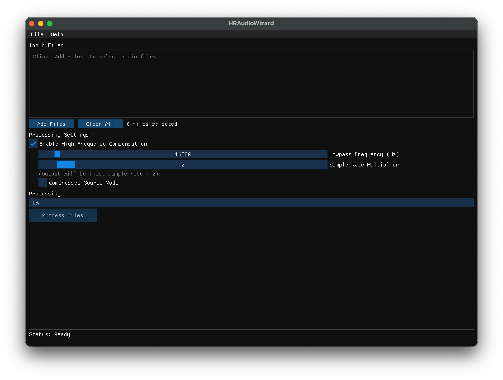

# HRAudioWizard C++

> [!WARNING]
> This project, including 99% of this README, is entirely vibe-coded using LLMs and may not be a 1:1 port of the original Python implementation. Educational purposes, dragons lie beyond, yada yada. I just wanted something faster that works to double the sample rate of various sound files. I barely tested it beyond the core functionality, so use at your own risk.

A high-performance C++ port of HRAudioWizard - an audio enhancement tool that uses high-frequency compensation (HFC) to improve the quality of low-fidelity recordings by synthesizing plausible high-frequency content.

## Features

- **High-Frequency Compensation**: Synthesizes missing high frequencies using harmonic overtone analysis
- **Flexible Upsampling**: Choose output sample rates from 1x to 16x the input rate  
~~- **Real-time Processing**: Fast STFT-based processing using KissFFT~~ To be implemented?
- **Modern GUI**: Built with Dear ImGui for a responsive, cross-platform interface
- **Batch Processing**: Process multiple audio files with progress tracking
- **Drag & Drop**: Simply drag audio files into the window  
~~- **Multiple Format Support**: Supports WAV, FLAC, OGG, and other formats via libsndfile~~ - this is probably a lie it always outputs WAV files I think, TODO fix that

## Screenshots



## Installation

### macOS

#### Prerequisites

1. Install Homebrew if you haven't already:
```bash
/bin/bash -c "$(curl -fsSL https://raw.githubusercontent.com/Homebrew/install/HEAD/install.sh)"
```

2. Install required dependencies:
```bash
brew install cmake libsndfile
```

#### Building from Source

1. Clone the repository:
```bash
git clone https://github.com/yourusername/HRAudioWizard_CPP.git
cd HRAudioWizard_CPP
```

2. Run the setup script to download KissFFT:
```bash
./setup_deps.sh
```

3. Build the project:
```bash
./build.sh
```

4. Run the application:
```bash
./run.sh
```

### Linux

*Didn't do it*

### Windows

*Didn't do this either*

## Usage

1. Launch the application
2. Click "Add Files" or drag audio files into the window
3. Configure settings:
   - **Enable HFC**: Toggle high-frequency compensation
   - **Lowpass Frequency**: Set the frequency above which to synthesize content (might be better to legit just set it to the max idk how this works)
   - **Sample Rate Multiplier**: Choose how much to upsample (2x, 4x, 8x, etc.)
   - **Compressed Source Mode**: Optimize for heavily compressed sources
4. Click "Process Files" to enhance your audio

The processed files will be saved in the same directory as the originals with "_enhanced" appended to the filename.

## How It Works

HRAudioWizard uses a sophisticated algorithm to analyze the harmonic structure of existing audio content and extrapolates plausible high-frequency components:

1. **STFT Analysis**: Converts audio to frequency domain using Short-Time Fourier Transform
2. **Peak Detection**: Identifies fundamental frequencies and their harmonics
3. **Harmonic Synthesis**: Generates overtones based on the spectral envelope
4. **Phase Reconstruction**: Uses Griffin-Lim algorithm for coherent phase
5. **Spectral Smoothing**: Applies temporal and frequency smoothing for natural results

## Building from Source

### Requirements

- C++17 compatible compiler
- CMake 3.10 or higher
- libsndfile
- OpenGL (usually pre-installed)

### Build Steps

```bash
# Clone the repository
git clone https://github.com/yourusername/HRAudioWizard_CPP.git
cd HRAudioWizard_CPP

# Download dependencies
./setup_deps.sh

# Build
mkdir build
cd build
cmake ..
make -j4

# Run
cd ..
./build/bin/HRAudioWizard
```

## Technical Details

- **FFT Size**: 4096 samples
- **Hop Size**: 2048 samples (50% overlap)
- **Window**: Hann window
- **Processing**: Mid/Side stereo processing
- **GUI Framework**: Dear ImGui with GLFW/OpenGL backend
- **DSP Library**: KissFFT for fast Fourier transforms
- **Audio I/O**: libsndfile for format support

## License

This project is licensed under the MIT License

## Acknowledgments

- Original Python implementation by [@Super-YH](https://github.com/Super-YH/HRAudioWizard)
- KissFFT by [Mark Borgerding](https://github.com/mborgerding/kissfft)
- Dear ImGui by [Omar Cornut](https://github.com/ocornut/imgui)
- libsndfile by [Erik de Castro Lopo](https://github.com/erikd/libsndfile)
